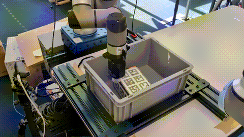

# Placing SERL

## EuroBox filling video


Video available for downloads [here](./docs/videos/robot_filling_box.mp4).

## Contributions

| Code Directory                                                                                             | Description                                |
|------------------------------------------------------------------------------------------------------------|--------------------------------------------|
| [box_placing_env](https://github.com/AndreaNappi00/placing-serl/blob/develop/serl_robot_infra/ur_env/envs/placing_env/box_placing_env.py)     | Environment setup for the corner box placing task |
| [box_placing_vertical_env](https://github.com/AndreaNappi00/placing-serl/blob/develop/serl_robot_infra/ur_env/envs/placing_env/box_placing_vertical_env.py) | Environment setup for the vertical box placing task |
| [Residual Learning](https://github.com/AndreaNappi00/placing-serl/blob/ab3a28bd288b619727e227b68877b692dfe28a33/serl_robot_infra/ur_env/envs/placing_env/box_placing_vertical_env.py#L131) | Residual Learning setup |
| [Generalization](https://github.com/AndreaNappi00/placing-serl/blob/develop/serl_robot_infra/ur_env/envs/relative_env.py)| Generalization fix and relative reward computation for both tasks |

## Quick start guide for box placing with a UR5 robot arm

### Without cameras (TODO modify the bash files)

1. Follow the installation in the official [SERL repo](https://github.com/rail-berkeley/serl).
2. Check [envs](https://github.com/AndreaNappi00/placing-serl/blob/develop/serl_robot_infra/ur_env/envs) and either use the provided [box_placing_env](https://github.com/AndreaNappi00/placing-serl/blob/develop/serl_robot_infra/ur_env/envs/placing_env/box_placing_env.py) or the [box_placing_vertical_env](https://github.com/AndreaNappi00/placing-serl/blob/develop/serl_robot_infra/ur_env/envs/placing_env/box_placing_vertical_env.py), depending on the task, or even set up a new environment using the one mentioned as a template. (New environments have to be registered [here](https://github.com/AndreaNappi00/placing-serl/blob/develop/serl_robot_infra/ur_env/__init__.py)).
2. Use the [config](https://github.com/AndreaNappi00/placing-serl/blob/develop/serl_robot_infra/ur_env/envs/placing_env/config.py) file to configure all the robot-arm specific parameters, as well as gripper and boxes configs.
3. Set up your own vision server and create a communication following the example [here](https://github.com/AndreaNappi00/placing-serl/blob/develop/serl_robot_infra/ur_env/utils/pose_estimation.py).
3. Go to the [box placing](https://github.com/AndreaNappi00/placing-serl/blob/develop/examples/box_placing_sac_hil) folder and modify the bash files ```run_learner.py``` and ```run_actor.py```. Alternatively the [box vertical placing](https://github.com/AndreaNappi00/placing-serl/blob/develop/examples/box_placing_vertical_sac_hil)
4. Record 20 demostrations using [record_demo.py](https://github.com/AndreaNappi00/placing-serl/blob/develop/examples/box_placing_sac_hil/record_demo.py) in the same folder.
5. Execute ```run_learner.py``` and ```run_actor.py```to start the RL training. I suggest to let the learner start with an advantage of around 1000 steps.
6. To evaluate on a policy, modify and execute ```run_evaluation.py``` with the specified checkpoint path and step. 
