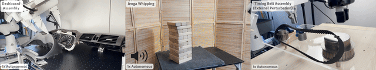

# HIL-SERL: Precise and Dexterous Robotic Manipulation via Human-in-the-Loop Reinforcement Learning




HIL-SERL provides a set of libraries, env wrappers, and examples to train RL policies using a combination of demonstrations and human corrections to perform robotic manipulation tasks with near-perfect success rates. The following sections describe how to use HIL-SERL. We will illustrate the usage with examples.

**Table of Contents**
- [HIL-SERL: Precise and Dexterous Robotic Manipulation via Human-in-the-Loop Reinforcement Learning](#serl-a-software-suite-for-sample-efficient-robotic-reinforcement-learning)
  - [Installation](#installation)
  - [Overview and Code Structure](#overview-and-code-structure)
  - [Run with Franka Arm](#run-with-franka-arm)
  <!-- - [Contribution](#contribution) -->
  - [Citation](#citation)

## Installation
1. **Setup Conda Environment:**
    create an environment with
    ```bash
    conda create -n hilserl python=3.10
    ```
    **Detailed environment creation script to be added soon**

2. **Install Jax as follows:**
    - For CPU (not recommended):
        ```bash
        pip install --upgrade "jax[cpu]"
        ```

    - For GPU:
        ```bash
        pip install --upgrade "jax[cuda12_pip]==0.4.35" -f https://storage.googleapis.com/jax-releases/jax_cuda_releases.html
        ```

    - For TPU
        ```bash
        pip install --upgrade "jax[tpu]" -f https://storage.googleapis.com/jax-releases/libtpu_releases.html
        ```
    - See the [Jax Github page](https://github.com/google/jax) for more details on installing Jax.

3. **Install the serl_launcher**
    ```bash
    cd serl_launcher
    pip install -e .
    pip install -r requirements.txt
    ```

## Overview and Code Structure

HIL-SERL provides a set of common libraries for users to train RL policies for robotic manipulation tasks. The main structure of running the RL experiments involves having an actor node and a learner node, both of which interact with the robot gym environment. Both nodes run asynchronously, with data being sent from the actor to the learner node via the network using [agentlace](https://github.com/youliangtan/agentlace). The learner will periodically synchronize the policy with the actor. This design provides flexibility for parallel training and inference.

<!-- <p align="center">
  
</p> -->

## Create a new task
1. **Create a new folder under examples/experiments, with the file:**
    - config.py
    - wrapppers.py
    - run_actor.sh
    - run_learner.sh
2. **The actor and learner scripts can just be copy and pasted with the respective directory and task names.**
3. **The config should be respective to the robot, inheriting the default environment config.**
4. **A class inheriting the training config that contains the create environment method. This method should initialize the robot environment and initialize all the necessary wrappers**
5. **The wrappers should include the class inheriting the robot environment specific to the task. It also requires all of the gymnasium wrappers, such as the reward clasifier wrapper, rotation represntation wrapper and/or gripper penalty wrapper etc.**
6. **Then, you need to register the task in the mappings.py under examples/experiments**
7. **To register a new robot, you need to create a new gymnasium environment and a controller to send the robot interface the actions**


## Citation

If you use this code for your research, please cite our paper:

